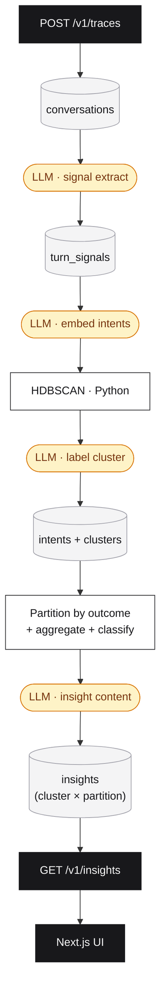

# REASONING

Sentiment engine for conversational AI agents. Conversations come in (OpenTelemetry-shaped), get classified per-turn, deduped into intents, clustered into topics, partitioned by outcome, and turned into typed actionable insights.

**Insights, not metrics** - *"20% of users requesting refunds due to X"*, *"hidden feature request Y"*. The system has to produce that shape, not a query result in prose form.

---

## Pipeline



---

## Key decisions

### 1. Classify-then-cluster, not embed-then-cluster

**Chose:** an LLM extracts a canonical intent string per user turn (`refund_old_order`, snake_case verb-noun). Those normalized strings get embedded and clustered, not the raw messages.

**Why:** same goal -> same string -> one cluster by construction. Clusters are interpretable for free (the intent strings *are* the label). Stable across embedding-model versions.

**Alternative:** pure embedding clustering of raw messages - noisier, drifts with model versions, needs a labeling pass anyway.

**Two consequences we caught and fixed:**

*Singleton noise.* Clustering operates on the deduplicated set of intent strings, not on raw messages. If 314 messages collapse to one canonical intent (`export_order_history`), the clustering layer sees one row, not 314. HDBSCAN's `min_cluster_size` drops singletons as noise. So the strongest patterns can disappear *because* classification worked too well.
> **Fix:** post-HDBSCAN noise promotion. Any noise intent representing >=15 user messages gets promoted to its own single-intent cluster.

*Filler intents surfacing as insights.* Rule above also promotes conversational glue (`provide_order_id`, `acknowledge`).
> **Fix:** `shouldSurfacePartition` - a two-gate filter. Gate A: regex denylist of non-topic intents. Gate B: cluster must show a real signal (negative sentiment, drop-off, escalation, attributed tool failure, or capability gap).

### 2. Insight = (cluster, outcome partition), not cluster

**Chose:** clusters are *topics*. Outcomes are deterministic categorizations (`succeeded`, `failed_at_tool`, `dropped_off`, `escalated`, `agent_gave_up`, `unresolved`). An insight is generated per (cluster, partition) pair. One refund cluster produces multiple insights - one for refund successes, one for refund failures at the policy gate, etc.

**Why:** a topical cluster contains multiple *patterns* - same topic, different stories. Collapsing them into one insight averages the metrics across mixed populations and inflates the volume. Real example: the refund cluster initially showed 183 conversations at -0.38 sentiment, but only 110 actually failed at the tool - the other 73 were satisfied users and silent drop-offs that the headline didn't speak for. After partitioning, the refund cluster splits into `failed_at_tool` (112 conversations at -0.56, attributed to `process_refund`), `succeeded` (43 at +0.55, refund-within-window cases), and `dropped_off` (24 at -0.77, users abandoning mid-flow). Three distinct stories. Across the whole dataset, numbers are within 1-3 of the seeded ground truth.

**Alternative:** push outcomes into the clustering features. Two problems - (a) outcomes don't attach to *intents*, they attach to conversations, and HDBSCAN's unit is the deduplicated intent string; (b) it would fragment topical clusters in the scatter view, losing topic-level structure for downstream analytics.

The two layers stay separate: HDBSCAN discovers topics (unsupervised, semantic), `partitionConversation` categorizes outcomes (deterministic, attribute-based). They compose at the insight layer.

**Refinement we caught and fixed.** A first-pass implementation used "did *any* tool fail in this conversation" to assign `failed_at_tool`. That bled across clusters: a refund conversation that incidentally hit a `check_inventory` error got partitioned as `failed_at_tool` for the refund cluster, and a lookup cluster ballooned to 93 conversations because conversations in it shared traces with failing refund tools elsewhere.

> **Fix:** tool relevance is now *cluster-topical*. For each cluster, we derive the set of tools that semantically belong to its dominant intents (`refund_*` -> `process_refund`, `*_shipping_*` -> `update_shipping_address`, etc.) via a small intent -> tool regex map. A conversation only counts as `failed_at_tool` for a cluster if a *relevant* tool failed; attribution candidates are filtered the same way. The lookup cluster's `failed_at_tool` count dropped from 93 to 59 against a seeded truth of 60 - the rest was cross-cluster bleed.
>
> The map is hand-coded per scenario today; data-driven derivation (per cluster, look at which tools actually get called in its conversations) is a v2.

### 3. HDBSCAN via Python, everything else TypeScript

**Chose:** TS for everything (ingest, signals, embed, persistence, API, UI). One 40-line Python file does the clustering, called as a JSON-in/JSON-out subprocess. PEP 723 inline metadata + `uv run` means no venv, no `requirements.txt`.

**Why:** HDBSCAN's canonical implementation is Python; TS ports are weaker. TS is most ergonomic for API + UI. Clustering is batch work, not a hot path - subprocess overhead is irrelevant.

**Alternative:** pure-Python would have hurt API + UI ergonomics. Pure-TS clustering would have meant DBSCAN (global `eps` weakness) or weaker ports.

The same Python script runs UMAP for the `/clusters` scatter - purely visualization, not part of insight generation.

### 4. Postgres + pgvector, not a dedicated vector DB

**Chose:** Postgres 16 with pgvector. HNSW index (`vector_cosine_ops`) on `intents.embedding`.

**Why:** the pipeline is *joins* - cluster -> intents -> signals -> turns -> tool_calls -> conversations, in one SQL statement. One operational surface.

**Alternative:** Qdrant / Chroma / Pinecone - would still need a relational store for the joins. Two systems to operate and keep consistent.

Failure attribution (the brief's "due to X") is computed from the relational join graph, then scoped to the outcome partition. The important shape is:

```sql
WITH cluster_tool_calls AS (
  SELECT DISTINCT i.cluster_id, tc.id, tc.tool_name, tc.status
  FROM intents i JOIN turn_signals s ON s.intent = i.intent
  JOIN turns t ON t.id = s.turn_id
  JOIN turns t2 ON t2.conversation_id = t.conversation_id
  JOIN tool_calls tc ON tc.turn_id = t2.id
  WHERE i.cluster_id IS NOT NULL
)
SELECT cluster_id, tool_name,
       count(*) FILTER (WHERE status IN ('error','empty_result'))::float / count(*) AS failure_rate
FROM cluster_tool_calls GROUP BY cluster_id, tool_name;
```

The `DISTINCT` CTE shape is load-bearing - without it, N user turns from one conversation multiply tool-call counts by N. The implementation also filters candidate tools through the cluster's relevant tool set before claiming attribution, so a refund cluster is not blamed for an unrelated inventory failure in the same conversation. The current relevance map is hand-coded for the assignment's assumed tool schema; a production version should learn this from tool usage metadata and traces.

**Switch point** to a dedicated vector store: 10M+ vectors with embedding-dominated workload. Not close.

### 5. OpenRouter for all chat + embeddings

**Chose:** OpenRouter as the gateway for every LLM and embedding call. Same OpenAI-compatible SDK, swap `baseURL` and the model slug to change provider.

**Why:** provider flexibility with one OpenAI-compatible SDK and one billing surface.

**Alternative:** direct OpenAI - locks in one provider; future swap to Claude / Gemini / Qwen would mean an SDK migration, not a config change.

**Per stage** (configurable via env):
- Dataset generator: `openai/gpt-4.1-mini` (tried `gpt-4o-mini` first; failed on multi-tool-call constraints).
- Signal extraction, cluster labeling, insight content: `openai/gpt-4o-mini`. Cheap and well within range.
- Embeddings: `openai/text-embedding-3-small`.

### 6. Three-axis tag typology, fixed vocab

**Chose:** every insight carries tags from three orthogonal axes, each with a fixed vocabulary:
- **Problem** - `capability_gap`, `tool_failure`, `agent_reasoning_gap`, `friction`, `drop_off`, `latency`, `success_pattern`, `uncategorized`
- **Trajectory** - `emerging`, `chronic`, `declining`, `stable`
- **Severity** - `high`, `medium`, `low`

**Why:** multi-axis lets PMs slice independently. A `tool_failure` can be `emerging` or `chronic` - different responses. Fixed vocab makes filtering and trend aggregation possible (`WHERE 'emerging' = ANY(tags)` is stable across runs). Closed structured layer, open content layer - domain richness lives in LLM-generated headlines.

**Alternative:** single exclusive type (loses dimensionality) or dynamic LLM tags (filtering breaks when the model picks "rising" once and "trending_up" the next).

`uncategorized` is a first-class tag; when its rate climbs above ~10%, the taxonomy is going stale. `TAXONOMY_VERSION` is stamped on every insight so trend data stays comparable across vocab changes.

### 7. Insights = headline + recommendation + observation, with metrics supporting

**Chose:** every insight carries a headline (pattern), a recommendation (what to do), and optionally a key observation (specific finding). Metrics still appear as supporting evidence.

**Why:** a number is data; an insight is *pattern + so-what*. *"X% of users did Y"* reads like a query result. Deterministic logic computes the metrics and tags; the LLM only writes the prose. Right tool per job. The LLM prompt receives the cluster label, partition, top-N intent strings, sample messages, and the computed metrics - grounded specificity, not freeform speculation.

**Alternative:** metric-shaped output (doesn't tell a PM what to do) or LLM-classified everything (loses consistency on the structured layer that powers filtering and trends).

### 8. Eval-set is the engineer's loop-closer

**Chose:** every insight exposes the conversations it was derived from - 3 inline previews on the insight row, plus a paginated full set at `GET /v1/insights/:id/eval-set` filtered to the insight's partition.

**Why:** a PM gets the insight; the engineer they hand it to needs *examples*. The same conversations double as a test set - ship a fix, re-run them, measure resolution rate. Recommendations become verifiable, not just readable.

---

## What I'd do with a month

1. **Cross-conversation canonicalization.** Today each conversation is scored independently, so `refund_old_order` and `request_refund` from different conversations don't merge until embedding-time. Hybrid open-vocab pre-pass: extract free intent, map to the nearest existing intent above a similarity threshold, otherwise add to the vocabulary.
2. **Calibrate `min_cluster_size` and other thresholds.** Right now they're guesses. The synthetic dataset already emits ground-truth labels per conversation - wire those into an evaluation harness and pick threshold values that best recover the seeded labels.
3. **Multi-intent extraction per turn.** Users sometimes say two things in one message. Today we collapse to one intent and lose signal.
4. **Eval-set as a runnable harness.** Make the eval-set executable: replay each conversation's user messages against a new agent build, report *resolution rate* on the partition and *regression rate* on a baseline set. Hard part isn't the harness; it's making replay deterministic when the agent under test hits real APIs. Once that exists, LLM-generated patches for `tool_failure` insights can be auto-PR'd with the harness numbers attached.
5. **Replace the regex non-topic denylist with a learned filter.** `shouldSurfacePartition` uses a fixed regex set. Works for known filler patterns but would miss novel ones.
6. **Real OTEL collector ingestion.** Today the inbound shape is OpenInference-flavored documents. Accept raw OTLP spans from any OpenTelemetry-instrumented agent via a collector adapter.
7. **Drift detection as an insight type.** Week-over-week intent distribution comparison. New tag axis: `regressing`.
8. **Taxonomy maintenance loop.** When `uncategorized_rate` crosses threshold, an LLM proposes candidate tags from the samples. Human approves into code. Bumps `TAXONOMY_VERSION`.
9. **Push heavy aggregations back into Postgres.** `aggregate.ts` runs the per-(cluster, partition) aggregations in Node memory. Fine at current scale; at ~50K+ conversations, move the heavy `GROUP BY` back to the DB.
10. **Cost & quality observability.** Per-stage LLM spend, retry rates, validation failure rates, cache hits. Treat this analytics pipeline the same way it treats its target agents.
