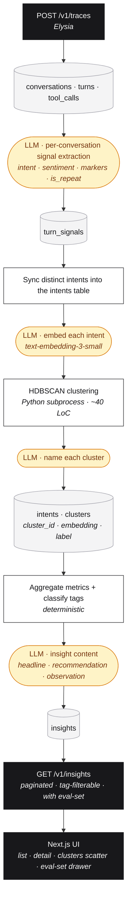

# REASONING

Sentiment engine for conversational AI agents. Conversations come in (OpenTelemetry-shaped), get classified per-turn, deduped into intents, then clustered and turned into typed, actionable insights for PMs and engineers. This document defends the substantive technical decisions.

Its **insights, not metrics** — *"20% of users requesting refunds due to X"*, *"hidden feature request Y"*. The system has to produce that shape, not a query result in prose form.

---

## Pipeline



---

## Key decisions

### 1. Classify-then-cluster, not embed-then-cluster

**The central architectural opinion.** Most "agent analytics" systems embed raw user messages and cluster the vectors directly. That fragments easily - same goal phrased five ways becomes five neighbours, not one cluster - and clusters drift across embedding-model versions.

Instead: an LLM extracts a **canonical intent string** per user turn (`refund_old_order`, `export_order_history`, snake_case verb-noun, 2-4 words). Those normalized strings get embedded and clustered. Same goal -> same string -> one cluster by construction.

Having pure embedding clustering of raw messages is noisier, harder to label and drifts across model versions. Current approach is more stable and produces better results.

**Two consequences we caught and fixed:**

**1. Singleton noise.** The clustering step doesn't operate on user messages directly - it operates on the *deduplicated set of intent strings* the LLM has extracted across the corpus. So if 314 different user messages all get classified with the same canonical intent (e.g., `export_order_history`), the clustering layer sees that as **one row**, not 314. HDBSCAN requires a minimum number of distinct neighbours to form a cluster (`min_cluster_size`), so anything sitting as a lone row gets labelled noise, even when it represents a huge fraction of the user base in reality.

The result: the strongest patterns can quietly disappear from the output, *because* classification worked well, a little too well.

> **Fix:** post-HDBSCAN noise promotion. Any noise intent representing >=15 user messages gets promoted to its own single-intent cluster.

**2. Filler intents surfacing as insights.** Rule #1 also promotes conversational glue - `provide_order_id`, `acknowledge`, `escalation_request`. These aren't actionable topics, they are just part of the talk that show up everywhere, nothing insightful in them.

> **Fix:** `shouldSurfaceCluster` - a two-gate filter applied before insight generation.
> - **Gate A (denylist):** regex match against non-topic intent patterns.
> - **Gate B (signal check):** the cluster must show at least one real signal. It can be negative sentiment, drop-off, escalation, attributed tool failure or a capability gap.
>
> These suppressed clusters still live in the DB and appear on the `/clusters` scatter, they just don't produce insights.

**What's left on the table**: per-message embedding precision. Intents that genuinely have multiple meanings (right now, we collapse them). the filler denylist is regex-based and would miss novel filler patterns.

### 2. HDBSCAN via Python, everything else TypeScript

TS for ingestion, signals, embeddings, persistence, API, UI. I've most experience in that stack and it's the most ergonomic for the project's needs. A 40-line Python script for the actual algorithm. Communicates via JSON-in/JSON-out subprocess. Inline metadata + `uv run` means the entire Python footprint is one self-contained file with its own dependency list. No venv. No `requirements.txt`. Replaceable by editing one file. Neat.

Instead of pure-Python project (TS preferred for API + UI ergonomics) or pure-TS clustering (would have had to settle for DBSCAN or weaker TS ports), I chose to use ones most suited for each job.

**Why DBSCAN's weakness matters less here than in general**: intent strings, being normalized, cluster at fairly uniform density anyway. But HDBSCAN gives a better cluster-stability signal and tuning ergonomics (`min_cluster_size` only; no `eps` to fight).

UMAP gets a free ride in the same subprocess: same embeddings, seeded with `random_state=42` so projections are stable across re-clusters. Powers the Clusters scatter view in UI.

### 3. Postgres + pgvector, not a dedicated vector DB

**Rejected**: Qdrant, Chroma, Pinecone, Weaviate.
**Choice**: Postgres 16 with the pgvector extension. HNSW index (`vector_cosine_ops`) on `intents.embedding`.

**Why**: the entire pipeline is *joins*. Cluster -> intents -> signals -> turns -> tool_calls -> conversations, in one SQL statement. Failure attribution (the "due to X" clause from the brief) is literally:

```sql
WITH cluster_tool_calls AS (
  SELECT DISTINCT i.cluster_id, tc.id, tc.tool_name, tc.status
  FROM intents i JOIN turn_signals s ON s.intent = i.intent
  JOIN turns t ON t.id = s.turn_id JOIN turns t2 ON t2.conversation_id = t.conversation_id
  JOIN tool_calls tc ON tc.turn_id = t2.id
  WHERE i.cluster_id IS NOT NULL
)
SELECT cluster_id, tool_name, count(*) FILTER (WHERE status IN ('error','empty_result'))::float / count(*) AS failure_rate
FROM cluster_tool_calls GROUP BY cluster_id, tool_name;
```

A vector DB can't do that without exporting back to a relational store anyway. The `DISTINCT` CTE is the star - without it, N user messages from one conversation multiply tool-call counts by N. I know it because I got that issue and fixed it.

**Switch point**: 10M+ vectors with embedding-dominated workload. We're not close.

### 4. OpenRouter for all chat + embeddings, not direct OpenAI

**Why**: I had around $100 credits there, so thought would utilize it. Also, provider flexibility costs nothing and saves a lot. Same OpenAI-compatible SDK call, swap the `baseURL` and the model slug:

- Dataset generator: `openai/gpt-4.1-mini` (we tried `gpt-4o-mini` first. It failed on multi-tool-call constraint satisfaction.)
- Signal extraction, cluster labeling, insight content: `openai/gpt-4o-mini` (single-pass classification is well within its range, also its cheap)
- Embeddings: `openai/text-embedding-3-small`

Each stage's model is environment-configurable (`SIGNAL_EXTRACTION_MODEL`, etc.) with sane defaults.

### 5. Three-axis tag typology, fixed vocab, evolved deliberately

Each insight carries tags from **three orthogonal axes**:

- **Problem** — `capability_gap`, `tool_failure`, `agent_reasoning_gap`, `friction`, `drop_off`, `latency`, `success_pattern`, `uncategorized`
- **Trajectory** — `emerging`, `chronic`, `declining`, `stable`
- **Severity** — `high`, `medium`, `low`

Instead of single exclusive type, we went with a constrained but typed list on three different axes. Dynamic LLM-generated tags would break the moment the model picks "rising" once and "trending_up" the next. You can't aggregate week-over-week in those cases.

**The structured layer is closed; the content layer is open.** Domain-specific richness lives in the LLM-generated `cluster_label`, `headline`, and `recommendation`. Tags exist for filtering, sorting, and trend stability. Mixing them would be a mistake.

`uncategorized` is a first-class tag, not a silent fallback. The pipeline reports `uncategorized_rate`. When it climbs above ~10%, the taxonomy is going stale. We also have `TAXONOMY_VERSION` that is stamped on every insight so trend data remains consistent across vocab changes.

### 6. Insights, not metrics: headline + recommendation + observation

The complaint we had to fix: *"X% of users did Y, Z% failed"* reads like a query result, not an insight. A number is **data**; an insight is **pattern + so-what**.

Every insight carries:

- **Headline** - the pattern in one sentence. Not metric-shaped. ("Refund policy is rejecting users with otherwise legitimate cases.")
- **Recommendation** - concrete action + rough impact. ("Extend the refund window to 60 days; ~183 conversations would resolve."). This is purely speculative and can be wrong. But it can be valuable if I get to work on it a little more.
- **Key observation** - optional, only when the data actually reveals something the aggregates don't. ("Most failures hit orders 31–60 days old - within reach of the policy line.")
- **Metrics still present** - volume %, sentiment, weekly sparkline, attribution, marker distribution, end-reason distribution. They *support* the insight rather than *being* the insight.

Deterministic logic computes the metrics and assigns the tags. The LLM only writes the prose. Metrics where it matters, prose where it adds polish. The prompt is given the cluster's metrics, its top-N dominant intent strings with message counts, and 8 sample user messages, with couple of hard rules:
- don't mention a tool unless attribution explicitly names one
- don't describe a positive-sentiment cluster as a problem

### 7. Eval-set is the engineer's loop-closer

A PM gets the insight - that's good. But when he goes to the engineer, he needs *examples* to write a fix against. So, I added something on every insight:

- `example_conversation_ids` - 3 precomputed previews on the insight row itself (cheap, instant). Good for a quick look.
- `GET /v1/insights/:id/eval-set?limit=&offset=` - paginated full conversation records (messages + tool_calls) for every conversation that contributed to the insight/cluster. Ordered descending for stable iteration.

These are the conversations the insight was derived from. Ship a fix -> re-run them -> measure resolution rate. Insights are good, but this is what makes them actionable beyond reading.

---

## What I'd reconsider

Honest about the rough edges I'd revisit before shipping this for real:

- **Cross-conversation intent** Each conversation is scored independently, so `refund_old_order` and `request_refund` from different conversations don't merge until embedding-time. The classify-then-cluster bet pays out at the clustering step, but a hybrid "here are the top-N known intents, reuse them if applicable" pre-pass would tighten it further.
- **Aggregations live in TS, not SQL.** The per-cluster pipeline in `aggregate.ts` uses Drizzle's `selectDistinct` and aggregates in Node memory rather than pushing `GROUP BY` into Postgres. Trade: end-to-end type safety + readability vs. database efficiency. At our scale this is fine; at ~50K+ conversations I'd push the heavy GROUP BY back into the DB via CTEs and accept the type cast at the boundary.
- **`min_cluster_size = 5` is a guess, should be dynamic and calibrated.** Calibrating against ground-truth labels (which we generate during dataset synthesis but don't currently use for evaluation) would let me defend the value rather than picking it.
- **Single intent per turn** Sometimes, user might have multiple intents in the same message. We are collapsing them into one itentnt per message right now. It runs the risk of losing signal. Multi-intent extraction from single message would help tighten the clustering. 
- **Non-topic intent filter is a regex denylist.** `shouldSurfaceCluster` suppresses clusters whose dominant intent matches a fixed pattern set (`acknowledge`, `provide_*`, `escalation_request`, ...). Works for known filler patterns but would miss novel ones. A learned classifier or a "must have a verb+object indicating a goal" check would scale better.

---

## What I'd do with a month

Scoped to *not* a redesign - extensions to what's there.

1. **Streaming / incremental clustering.** Postgres `LISTEN`/`NOTIFY` on new traces -> worker that runs the per-conversation signal extraction immediately; clustering runs hourly with incremental updates rather than batch recompute.
2. **Real OTEL collector ingestion.** Today the inbound shape is OpenInference-flavored conversation documents. A better version would accept raw OTLP spans from any OpenTelemetry-instrumented agent (LangSmith, AgentOps, OpenInference, custom) via a collector adapter.
3. **Cross-conversation canonicalization.** The hybrid open-vocab approach I deferred above. Two-pass: extract free intent, then map to nearest existing intent above similarity threshold; otherwise add to the vocabulary.
4. **Eval-set as a runnable harness, then patch suggestions on top.** Today the eval-set is conversations a human reads. The next step is to make it executable. Point the harness at a new agent build (Docker image, API endpoint or something else) and replay each conversation's user messages against it. Capture the new tool calls, re-run signal extraction on the replays and see the results - *resolution rate on the cluster's conversations* and *regression rate on a baseline set*. The hard part isn't the harness though. It's making replay deterministic when the agent under test hits real APIs (a tool-call sandbox or a "replay mode" the target agent has to opt into). Once that exists, an LLM-generated patch for a `tool_failure` insight (prompt tweak, tool spec change) can be pushed as a PR with the harness numbers attached. This way, fixes get measured, not just shipped. The patch generation is the speculative but the harness is the foundation that makes everything downstream of it actually verifiable.
5. **Drift detection as an insight type.** Week-over-week intent distribution comparison. This would help us tweak the taxonomy to avoid regressions. New tag axis can be exposed: `regressing` (something that was stable started going wrong).
6. **Taxonomy maintenance loop.** When `uncategorized_rate` crosses threshold, an LLM proposes candidate tags from the uncategorized clusters' samples. Human approves into code. Bumps `TAXONOMY_VERSION`. Background job re-tags historical insights.
7. **Embedding model migration.** Today, re-embedding requires re-clustering. Versioned `intents.embedding_v` + a migration job that re-clusters within a model version without invalidating historical insights. Might be helpful for preserving embedding quality across model versions.
8. **Cost & quality observability.** Per-stage LLM spend, retry rates, validation failure rates, embedding cache hits etc. Treat this analytics pipeline the same way it treats its target agents.

---

## Stack

| Layer | Choice | Why over alternatives |
|---|---|---|
| Runtime | Bun | Native TS, fast spawn (relevant for the Python subprocess), no build step |
| API | Elysia | Idiomatic Bun, light, doesn't impose conventions |
| DB | Postgres 16 + pgvector | Joins are the killer feature; HNSW for ANN; one ops surface |
| ORM | Drizzle | Type-safe queries; CTEs and `inArray` as first-class |
| Validation | Zod everywhere | Same schema used at ingestion, LLM structured outputs, and API responses |
| LLM | OpenRouter | Provider-swappable; OpenAI-compatible SDK; single billing |
| Clustering | `hdbscan` + `umap-learn` via subprocess | Canonical implementation; ~40 LoC of Python; PEP 723 inline deps |
| Frontend | Next.js 15 + Tailwind v4 + shadcn-style primitives | Server components for data, client only where needed; URL-state filters; no chrome over the data |

— Kashyap Gohil
